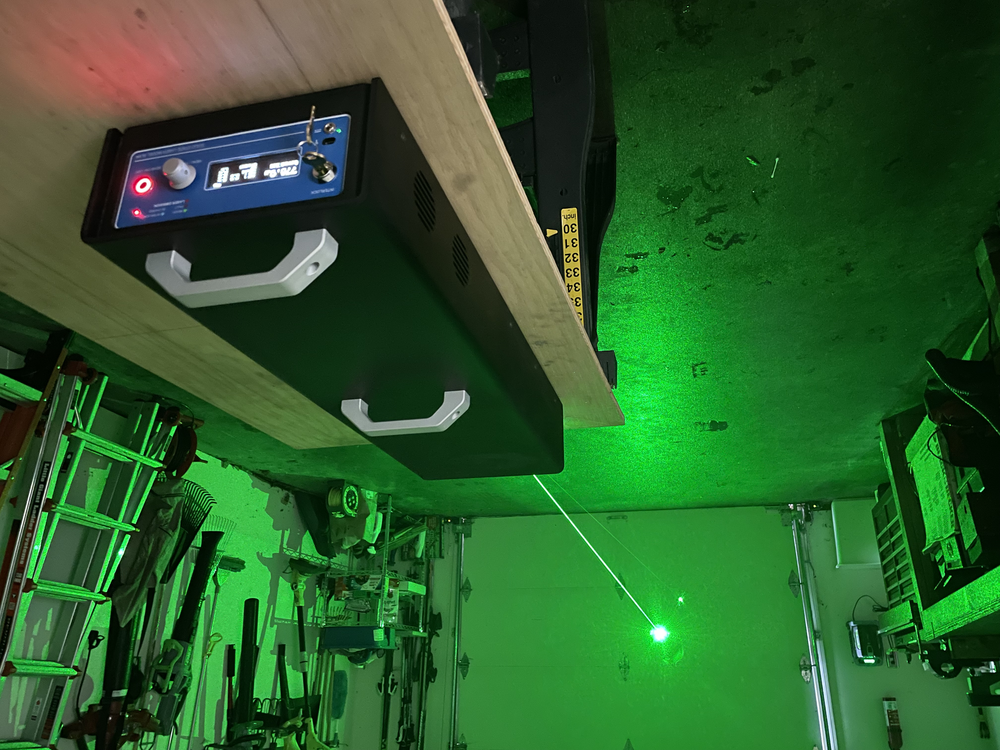
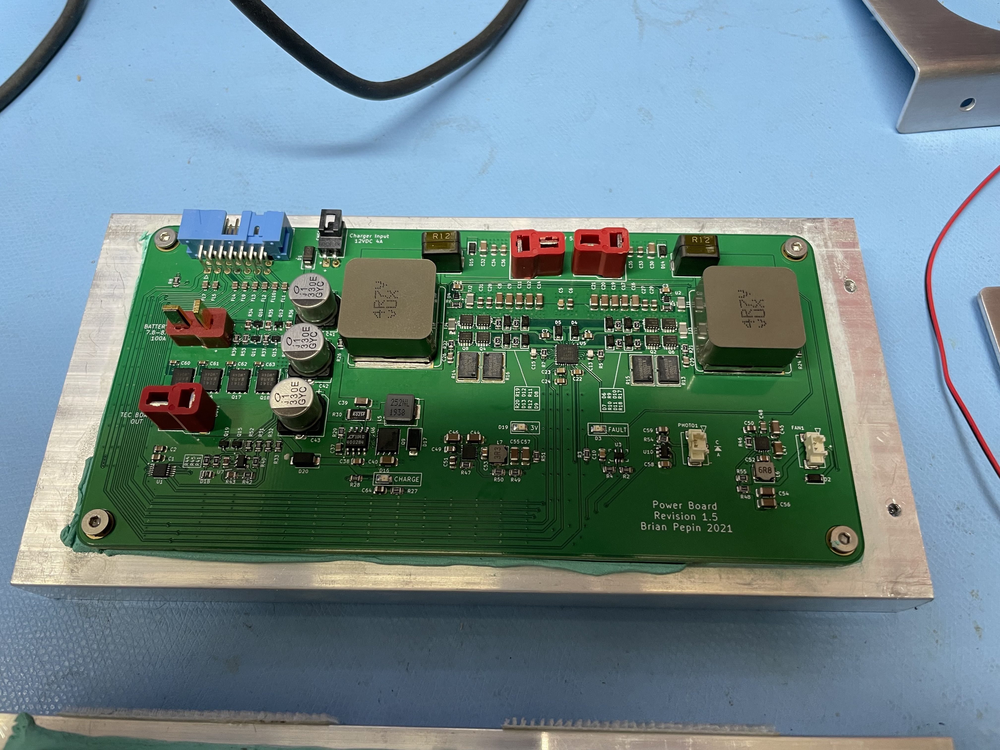
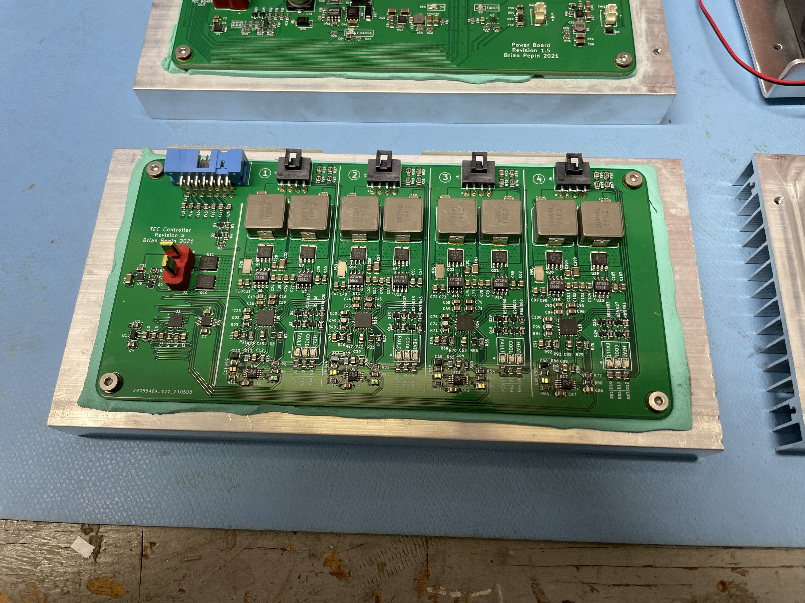
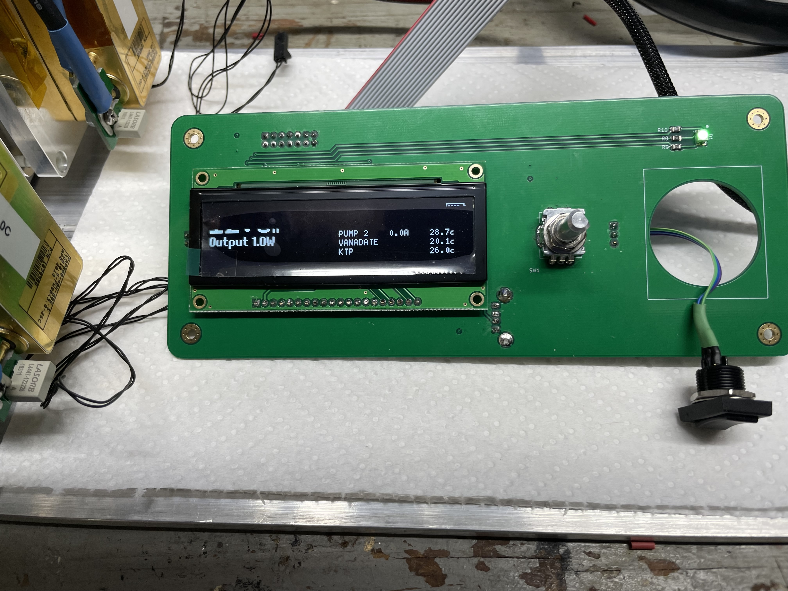

# The Laser Project
This repository contains a design for a diode pumped solid state laser that emits a green 532nm beam.  The unit is battery operated and rechargable with a runtime of approximately 30 minutes.

## Repository Organization

The repository contains the following directories.

### Hardware
The Hardware directory contains KiCad files for schematics and board designs for the electronics.  There are three boards in total:

1. The **Power** board is the main power supply. It contains a battery charger, power control, power monitoring, fan controller, and two 50A constant current power supplies.

2. The **TEC** board contains four independent channels for controlling thermo-electric coolers. Each channel can control up to 20A of cooling using direct battery voltage.

3. The **Control** board is a small MCU and display for running the laser.  The board is based on the aging ATMEGA328p....but it would be easy to swap this to a newer MCU.

The power and TEC boards must both be bonded to heat sinks on the underside of the board using a non-conductive thermal layer. Boards use Deans connectors for high power and these connectors were modified (pins trimmed) so when soldered the back of the board remains relatively flat.

The system is designed to run off a 2S LiPo pack (I'm using two 8Ah packs in parallel). If you need higher voltage for the TECs you can go to 3S but may need to modify the charging circuit, which is designed for a 2S cell.

### Software
The software directory contains the source code for the controller. It uses Platform.IO in Visual Studio Code and levages Arduino libraries for convenience, especially for driving the display. Installing Platform.IO should be sufficient to find dependent libraries.
The software is organized to have a lib directory that contains generic driver code for chips used on each of the boards.  In the src directory these generic classes are wrapped by higher level classes that abstract their use.  For example, lib has directories called ADC104S021 and DAC108S085 for controlling ADC and DAC chips, and src has a class called TEC that uses both these lower level classes but provides an interface in degrees C.

### Optics
Optics contains files relevant to the optical layout.  Files ending in .rez are Rezonator files, which is an open-source program available at http://www.rezonator.orion-project.org which can do ABCD matrix analysis of laser cavities for stability and Gaussian beam analysis.  
